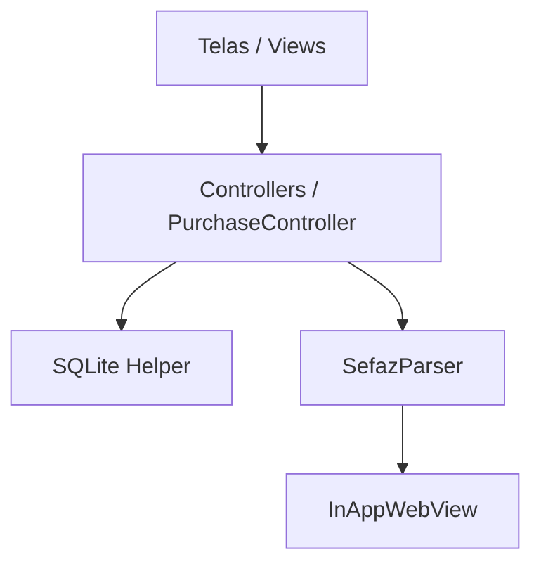

# Documentação do Aplicativo - Organiza Compras

Bem-vindo à documentação oficial do **Organiza Compras**, um aplicativo mobile moderno desenvolvido em **Flutter** focado na gestão financeira pessoal através da importação automática de notas fiscais (NFC-e e NF-e) diretamente dos portais da SEFAZ brasileira.

---

## 📱 Visão Geral do Aplicativo
O **Organiza Compras** resolve o problema de registrar compras domésticas e de supermercado manualmente. Através da leitura de **QR Codes** ou **Códigos de Barras** impressos nos cupons fiscais, o aplicativo abre o portal da SEFAZ, contorna barreiras de busca injetando automações inteligentes de preenchimento e lê os dados da nota. Tudo fica salvo localmente no dispositivo para análises de gastos e histórico de preços.

---

## ✨ Recursos Principais (Features)

### 1. Escaneamento e Leitura de Códigos
- **Leitor de QR Code & Códigos de Barras**: Utilização da biblioteca de alta performance `mobile_scanner` com guias visuais e uma interface moderna de overlay.
- **Roteamento Dinâmico por Estado**: O aplicativo detecta a Unidade Federativa (UF) emissora a partir dos primeiros dois dígitos da chave de acesso e gera a URL correspondente de consulta.
- **Diferenciação de Modelo de Notas**: Para a SEFAZ Ceará (CE), o app detecta se é uma **NF-e** (Modelo 55) ou uma **NFC-e** (Modelo 65), direcionando para o respectivo portal de produção funcional.

### 2. Automação Inteligente de Consulta (WebView)
- **Preenchimento Automático (Autofill)**: Script JavaScript injetado no carregamento da página governamental localiza os campos de texto adequados (pela propriedade `maxlength="44"`, placeholders ou IDs de chave de acesso) e digita automaticamente a chave de 44 números.
- **Auto-clique Inteligente**: Se a página não exigir validação de CAPTCHA, o robô clica sozinho nos botões de busca ("Consultar", "Pesquisar", etc.).
- **Navegação de Abas Automática**: Em portais como o do Ceará, os produtos ficam ocultos até que a aba "Produtos/Serviços" seja aberta. O script simula o clique nessa aba de forma instantânea.
- **Captura sem Fechamento Precoce**: O script avaliador aguarda a tabela de itens e os totais de pagamento renderizarem em tela antes de enviar o HTML e fechar o WebView, evitando importações incompletas ou telas em branco.

### 3. Banco de Dados Local (SQLite)
- Persistência 100% offline para garantir total privacidade dos dados financeiros do usuário.
- Estrutura otimizada em tabelas relacionais de **Compras** (Cabeçalho da nota, CNPJ, estabelecimento, valor total, data) e **Itens** (Nome do item, quantidade, unidade, valor unitário, valor total, categoria).
- Tabela dedicada de **Configurações (Settings)** para salvar opções personalizadas do usuário, como o estado padrão de consulta.

### 4. Categorização Inteligente de Produtos
- Os itens comprados são classificados em categorias pré-definidas com base em filtros de texto:
  - **Alimentação** (Ex: leite, arroz, pão, carnes)
  - **Bebidas** (Ex: refrigerantes, sucos, cervejas)
  - **Limpeza** (Ex: sabão em pó, detergentes, amaciantes)
  - **Higiene** (Ex: sabonete, creme dental, shampoo)
  - **Outros** (Qualquer item não correspondente)

### 5. Histórico e Detalhes da Compra
- **Linha do Tempo de Compras**: Tela inicial elegante exibindo as compras ordenadas por data com seus respectivos valores totais, quantidades de itens e nomes dos estabelecimentos.
- **Visualização Detalhada**: Tela que exibe a nota fiscal de forma digitalizada, separando itens, preços unitários e permitindo o descarte ou arquivamento das compras.

### 6. Histórico de Preços por Produto
- Permite pesquisar um produto específico da despensa e ver o histórico de variação de preço ao longo do tempo (visualizando em qual supermercado o item estava mais barato).

### 7. Relatórios e Insights Financeiros
- Análise gráfica intuitiva exibindo a distribuição dos seus gastos por categoria.
- Painel financeiro de despesas mensais para maior previsibilidade de consumo.

---

## 🛠️ Arquitetura Técnica

O aplicativo é estruturado seguindo os princípios de separação de responsabilidades (Model-View-Controller-Service):



### Principais Módulos do Sistema
1. **Camada de Telas (`lib/screens/`)**:
   - `splash_screen.dart`: Tela inicial de boas-vindas com micro-animação.
   - `home_screen.dart`: Painel principal com histórico, atalhos rápidos e resumo financeiro.
   - `scan_screen.dart`: Interface de câmera que aciona a WebView automatizada em caso de nota real.
   - `purchase_detail_screen.dart`: Detalhamento dos itens de uma nota importada.
   - `reports_screen.dart`: Estatísticas de custos mensais e gráficos de categorias.
   - `products_screen.dart` & `product_history_screen.dart`: Gerenciamento e acompanhamento de preços de itens comprados.
   - `settings_screen.dart`: Painel de preferências (como alteração do estado de consulta padrão).

2. **Serviço de Processamento (`lib/services/sefaz_parser.dart`)**:
   - Centraliza a decodificação da chave de acesso a partir de URLs de QR Code.
   - Executa a análise (parsing) do HTML governamental através da biblioteca `html` do Dart, usando seletores flexíveis (`#tabResult tr`, `.table tr`, `.txtTit`) para extrair os produtos e valores mesmo com layouts variantes entre estados.

3. **Gerência de Estado (`lib/controllers/purchase_controller.dart`)**:
   - Gerencia o estado de carregamento de compras do SQLite e coordena chamadas entre o leitor de notas e as atualizações de interface.

---

## 🚀 Como Executar e Requisitos

### Pré-requisitos
- Flutter SDK instalado (Versão estável atualizada).
- Dispositivo Android ou iOS conectado (ou emulador com câmera simulada para testes de escaneamento).

### Instalação de Dependências
No terminal, na raiz do projeto, execute:
```bash
flutter pub get
```

### Executar em Modo Desenvolvimento
```bash
flutter run
```
